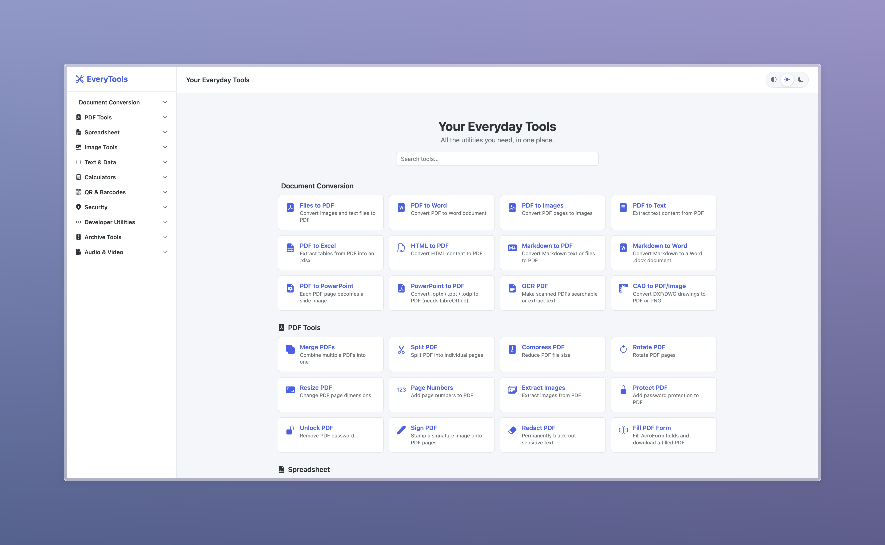
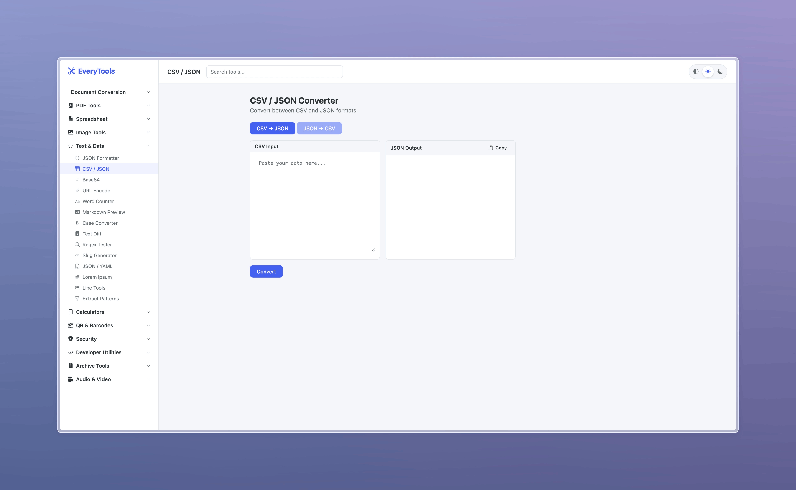
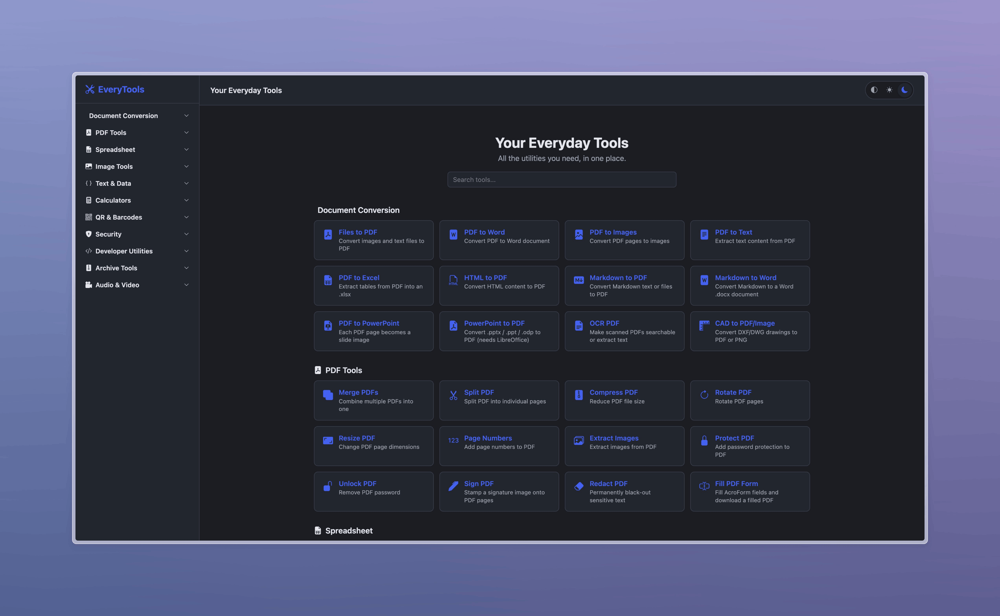
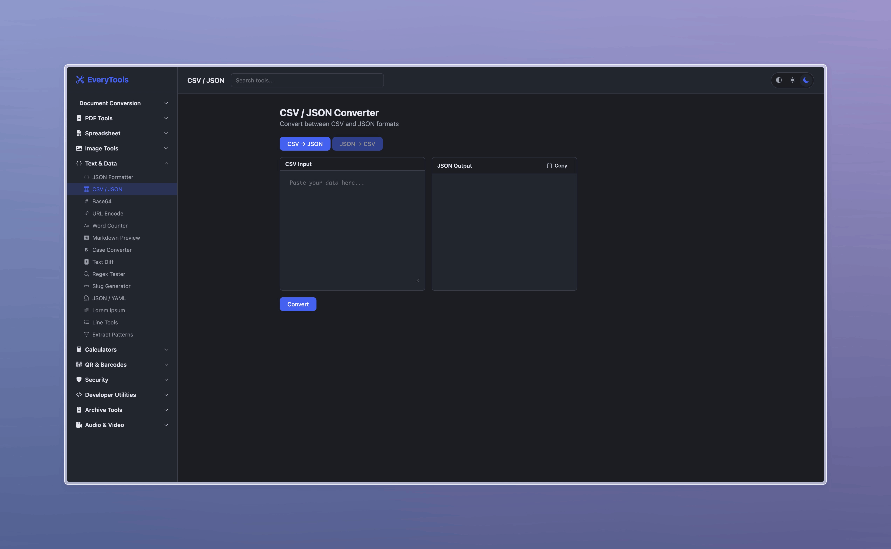

# Your Everyday Tools

A lightweight, self-hosted web app that bundles 100 everyday utilities into a single interface. Built with Python + Flask, zero JavaScript frameworks, and minimal CSS — no bloat, just tools.


See [CHANGELOG.md](CHANGELOG.md) for release history and recent fixes.

**Mirrors** (pick whichever you prefer — same code, same branch):

- Codeberg: https://codeberg.org/listyantidewi/your-everyday-tools
- Bitbucket: https://bitbucket.org/your-everyday-tools/your-every-tools

---

## Screenshots









---

## Features

### Document Conversion

| Tool                 | Description                                                                                                                                                                                                                      |
| -------------------- | -------------------------------------------------------------------------------------------------------------------------------------------------------------------------------------------------------------------------------- |
| **Files to PDF**     | Convert images (JPG, PNG, BMP, TIFF, WebP), Word documents (.docx, .doc, .odt), and text files to PDF. Word files prefer LibreOffice for full-fidelity layout; lower-fidelity `.docx` fallback must be explicitly allowed.                 |
| **PDF to Word**      | Convert PDF documents to `.docx`. Five modes: **Exact visual copy** (non-editable page images, best appearance), **Layout** (editable, lossy), **Smart structure**, **Flowing text**, and **Marker** (optional ML structure engine). Page range supported on all modes. |
| **PDF to Images**    | Export each PDF page as PNG or JPG (configurable DPI)                                                                                                                                                                            |
| **PDF to Text**      | Extract all text content from a PDF                                                                                                                                                                                              |
| **PDF to Excel**     | Extract tables from a PDF into an `.xlsx` workbook — one sheet per table, per page, or all combined. Uses optional `pdfplumber` first when available, with PyMuPDF as the built-in local fallback. |
| **HTML to PDF**      | Convert HTML content to a PDF document. Uses LibreOffice for full CSS / table / image support when available; lower-fidelity PyMuPDF fallback must be explicitly allowed.                                                                       |
| **Markdown to PDF**  | Paste or upload Markdown (.md) and download a formatted PDF. Choose page size and base font size. Uses PyMuPDF's `Story` API for proper multi-page pagination.                                                                   |
| **Markdown to Word** | Convert Markdown to a `.docx` document with correct heading, list, quote, and code styles                                                                                                                                        |
| **PDF to PowerPoint** | Convert PDFs to `.pptx` using editable LibreOffice mode when available, or image-per-slide mode for non-editable visual preservation. Choose slide size, page range, and DPI in image mode.                                                                                            |
| **PowerPoint to PDF** | Convert `.pptx` / `.ppt` / `.odp` presentations to PDF through the hardened LibreOffice wrapper (isolated profile, safer timeout, robust output detection).                                                                                                                                            |
| **OCR PDF**          | Make scanned PDFs searchable (image + hidden text layer) or extract text — 14 languages supported                                                                                                                                |
| **CAD to PDF/Image** | Convert DXF drawings to PDF or PNG (DWG via optional ODA File Converter)                                                                                                                                                         |

### Spreadsheet

| Tool                     | Description                                                                                                                                                                                                  |
| ------------------------ | ------------------------------------------------------------------------------------------------------------------------------------------------------------------------------------------------------------ |
| **Excel to CSV / JSON**  | Export sheets from `.xlsx` / `.xls` to CSV or JSON (array-of-objects or array-of-arrays). Single sheet or all sheets as ZIP.                                                                                 |
| **CSV / JSON to Excel**  | Build an `.xlsx` workbook from one or more CSV or JSON files — one sheet per file, optional bold/shaded header row                                                                                           |
| **Excel to PDF**         | Convert workbooks to PDF with LibreOffice for high-fidelity print/layout preservation. The older ReportLab table renderer remains as an explicit basic fallback.                                                          |
| **Merge Workbooks**      | Combine multiple Excel files into a single workbook, optionally prefixing each sheet with its source filename                                                                                                |
| **Split Sheets**         | Export each sheet of a workbook as its own `.xlsx` (bundled as a ZIP if more than one)                                                                                                                       |
| **Excel Info & Preview** | List sheet names, row/column counts, and preview the first N rows of every sheet                                                                                                                             |
| **CSV Toolkit**          | Filter, sort, and de-duplicate CSV rows. Auto-detects delimiter. Filter operators: `=`, `!=`, `contains`, `startswith`, `endswith`, `>`, `>=`, `<`, `<=`, `empty`, `notempty`. Full-row or by-column dedupe. |

### PDF Tools

| Tool               | Description                                                                                             |
| ------------------ | ------------------------------------------------------------------------------------------------------- |
| **Merge PDFs**     | Combine multiple PDF files into one document                                                            |
| **Split PDF**      | Split a PDF into individual pages or custom page ranges                                                 |
| **Compress PDF**   | Reduce PDF file size (low / medium / high compression)                                                  |
| **Rotate PDF**     | Rotate all or specific pages (90, 180, 270 degrees)                                                     |
| **Resize PDF**     | Scale pages by percentage or fit to standard paper sizes (A3–A5, Letter, Legal)                         |
| **Page Numbers**   | Add page numbers with configurable position, font size, and start number                                |
| **Extract Images** | Extract all embedded images from a PDF                                                                  |
| **Protect PDF**    | Encrypt a PDF with user and owner passwords (AES-256)                                                   |
| **Unlock PDF**     | Remove password protection from a PDF                                                                   |
| **Sign PDF**       | Stamp a signature image (PNG/JPG) onto selected pages with position, width, margin, and opacity control |
| **Redact PDF**     | Permanently black-out sensitive text by literal match or regex (emails, card numbers, IDs, etc.). Underlying text is removed from the content stream so it can't be recovered with copy-paste. |
| **Fill PDF Form**  | Upload a PDF that has AcroForm fields (tax forms, contracts, gov applications), fill text/checkbox/radio/dropdown fields in your browser, and download the filled PDF. Two-step flow: detect fields → fill → download. |

### Image Tools

| Tool                    | Description                                                                                                                             |
| ----------------------- | --------------------------------------------------------------------------------------------------------------------------------------- |
| **Resize Image**        | Resize by percentage or exact pixel dimensions (with aspect ratio lock)                                                                 |
| **Compress Image**      | Reduce file size with Auto, Photo/JPEG, Lossless PNG, and WebP modes. Applies EXIF orientation and preserves transparency/profile data where possible.                                                                               |
| **Convert Format**      | Convert between PNG, JPG, WebP, BMP, and TIFF                                                                                           |
| **Remove Background**   | Automatically remove image backgrounds using AI                                                                                         |
| **Crop Image**          | Crop by aspect ratio (1:1, 4:3, 16:9, etc.) or custom coordinates                                                                       |
| **Rotate / Flip**       | Rotate 90/180/270 degrees, flip horizontal or vertical                                                                                  |
| **Add Watermark**       | Add text watermark with configurable position, opacity, size, and tiled mode                                                            |
| **EXIF Viewer**         | View or strip image metadata (EXIF data) for privacy                                                                                    |
| **Favicon Generator**   | Create .ico favicons from any image with multiple size options                                                                          |
| **Image to Text (OCR)** | Extract text from images using optical character recognition                                                                            |
| **Animated WebP/GIF**   | Convert between animated GIF and animated WebP (preserves per-frame timing)                                                             |
| **Color Palette**       | Extract a dominant color palette (2–16 colors) from an image via quantization or grid sampling. Includes swatch preview with hex codes. |
| **SVG to PNG**          | Rasterize SVG vectors to PNG in the browser first for better SVG fidelity, with the existing local server renderer as fallback.                                                    |
| **SVG Optimizer**       | Strip comments, editor metadata (Inkscape/Sketch/Adobe namespaces), and round decimals to shrink SVG files                              |
| **HEIC Converter**      | Convert iPhone `.heic` / `.heif` photos to JPG, PNG, or WebP (single or bulk → ZIP). Once installed, all other image tools also accept HEIC inputs.                                          |

### Text & Data (client-side, no upload needed)

| Tool                 | Description                                                                        |
| -------------------- | ---------------------------------------------------------------------------------- |
| **JSON Formatter**   | Format, validate, and minify JSON                                                  |
| **CSV / JSON**       | Convert between CSV and JSON in both directions                                    |
| **Base64**           | Encode and decode Base64 strings                                                   |
| **URL Encode**       | Encode and decode URL components                                                   |
| **Word Counter**     | Count words, characters, sentences, paragraphs, and estimate reading time          |
| **Markdown Preview** | Live Markdown-to-HTML preview                                                      |
| **Case Converter**   | Convert between UPPER, lower, Title, camelCase, snake_case, kebab-case, PascalCase |
| **Text Diff**        | Compare two texts side by side with highlighted additions and deletions            |
| **Regex Tester**     | Test regular expressions with live match highlighting and group extraction         |
| **Slug Generator**   | Create URL-friendly slugs from any text                                            |
| **JSON / YAML**      | Convert between JSON and YAML formats                                              |
| **Lorem Ipsum**      | Generate placeholder text by paragraphs, sentences, or words                       |
| **Line Tools**       | Sort A→Z / Z→A / numerically, dedupe (keep order or alphabetic), shuffle, reverse, trim, drop empty, number lines, count words/chars |
| **Extract Patterns** | Pull emails, URLs, phone numbers, IPv4/IPv6 addresses, hashtags, @mentions, or numbers out of any text — with dedupe and sorting     |

### Calculators (client-side)

| Tool                      | Description                                                                     |
| ------------------------- | ------------------------------------------------------------------------------- |
| **Calculator**            | Basic + scientific calculator with keyboard support                             |
| **Unit Converter**        | Length, weight, temperature, area, volume, speed, data, and time                |
| **Color Converter**       | Convert between HEX, RGB, and HSL with live preview and color picker            |
| **Percentage Calc**       | Four common percentage calculations in one page                                 |
| **Date Calculator**       | Date difference, add/subtract days, day-of-week lookup                          |
| **Timestamp Converter**   | Convert between Unix timestamps and human-readable dates (local, UTC, ISO 8601) |
| **Number Base Converter** | Convert between decimal, binary, octal, and hexadecimal                         |
| **Pomodoro Timer**        | Focus timer with configurable work/break intervals and session tracking         |

### QR & Barcodes

| Tool                 | Description                                                                                       |
| -------------------- | ------------------------------------------------------------------------------------------------- |
| **Generate QR**      | Create QR codes from text/URLs with custom size, border, and color                                |
| **Read QR**          | Decode QR codes from uploaded images                                                              |
| **Generate Barcode** | Create 1D barcodes — Code128, Code39, EAN-13/8, UPC-A, ISBN-10/13, ISSN, JAN, PZN — as PNG or SVG |
| **WiFi QR Code**     | Generate a scan-to-join WiFi QR (WPA / WEP / open). Special characters in SSID/password are properly escaped. Print and stick on a wall. |

### Security

| Tool                   | Description                                                                                                     |
| ---------------------- | --------------------------------------------------------------------------------------------------------------- |
| **Password Generator** | Generate strong random passwords with configurable length, character types, and entropy display                 |
| **Hash Generator**     | Generate MD5, SHA-1, SHA-256, and SHA-512 hashes from text                                                      |
| **File Hash**          | Compute MD5, SHA-1, SHA-256, and SHA-512 hashes of an uploaded file (streamed, no size cap beyond upload limit) |
| **Encrypt File**       | AES-256-CBC encrypt any file with a passphrase. PBKDF2-HMAC-SHA256 (600,000 iterations) for key derivation. Output is byte-identical to `openssl enc -aes-256-cbc -pbkdf2 -iter 600000`. |
| **Decrypt File**       | Decrypt files produced by Encrypt File or by the matching `openssl` command. Wrong passphrase returns a clean error rather than corrupted output. |

### Developer Utilities

| Tool                  | Description                                                                                                            |
| --------------------- | ---------------------------------------------------------------------------------------------------------------------- |
| **UUID Generator**    | Generate v4 UUIDs — single or bulk (up to 1000), with uppercase, brace, and no-dash formatting                         |
| **JWT Decoder**       | Decode JSON Web Tokens client-side to inspect header, payload, and claims (decode only — does not verify signatures)   |
| **User-Agent Parser** | Parse browser, OS, device, and engine from any User-Agent string                                                       |
| **SQL Formatter**     | Pretty-print SQL with configurable keyword casing (UPPER / lower / Capitalize) and indentation — powered by `sqlparse` |
| **XML Formatter**     | Format, validate, and minify XML using the browser's native DOMParser                                                  |
| **HTML Formatter**    | Beautify or minify HTML source (void tags, inline tags, and `<script>` / `<style>` content handled correctly)          |
| **CSS Formatter**     | Beautify or minify CSS rules with indent-aware output                                                                  |
| **JS Formatter**      | Basic JavaScript beautifier and minifier (for complex code, use Prettier)                                              |
| **Cron Parser**       | Validate cron expressions, see next upcoming run times, and get a field-by-field breakdown                             |
| **JSONPath Tester**   | Evaluate JSONPath expressions against JSON data — supports extended syntax via `jsonpath-ng`                           |

### Archive Tools

| Tool            | Description                                                                                                   |
| --------------- | ------------------------------------------------------------------------------------------------------------- |
| **Create ZIP**  | Bundle multiple files into a single `.zip`, choose Deflate or Store compression                               |
| **Extract ZIP** | Extract the contents of a `.zip` and re-download them (encrypted ZIPs not supported; 500 MB total cap)        |
| **ZIP Info**    | List all entries in a `.zip` with uncompressed/compressed sizes, modified date, and overall compression ratio |

### Audio & Video (requires `ffmpeg` on PATH)

| Tool                  | Description                                                                                  |
| --------------------- | -------------------------------------------------------------------------------------------- |
| **Convert Audio**     | Convert between MP3, WAV, OGG, FLAC, AAC, M4A, and Opus with adjustable bitrate              |
| **Convert Video**     | Convert between MP4, WebM, MKV, MOV, and AVI. Uses ffprobe metadata to preserve compatible streams, otherwise re-encodes with clear quality presets.       |
| **Extract Audio**     | Pull the audio track out of a video file to MP3 / WAV / OGG / M4A                            |
| **Trim Media**        | Trim audio or video by start/end time (stream-copy first, re-encodes on keyframe mismatch)   |
| **Compress Video**    | Re-encode video with H.264 at a chosen CRF and preset to shrink file size                    |
| **Video to GIF**      | Convert a clip to an animated GIF with configurable FPS, width, start, and duration          |
| **Convert Subtitles** | Convert between SRT and WebVTT with optional time shift (positive or negative seconds)       |
| **Burn Subtitles**    | Permanently render a `.srt`/`.vtt` into a video (hardsub) with font-size and quality control |
| **Normalize Audio**   | Loudness-normalize audio (or video) to a target LUFS via FFmpeg `loudnorm`. Presets for streaming (-14), Apple Podcasts (-16), EBU R128 broadcast (-23), ATSC A/85 (-24). |
| **Speech to Text**    | Local Whisper transcription to text, SRT, or VTT. Choose model size (tiny → large) and language hint. Optional install: `pip install openai-whisper`. Slow on CPU, fast on GPU.            |

---

## Quick Start

### Easy start (recommended — no command line needed)

Install [Python 3.10+](https://www.python.org/downloads/) once (on Windows, tick **"Add Python to PATH"** during install), then:

| OS          | What to do                                                                                                                                               |
| ----------- | -------------------------------------------------------------------------------------------------------------------------------------------------------- |
| **Windows** | Double-click `run.bat`                                                                                                                                   |
| **macOS**   | Double-click `run.command`. First time only, open Terminal in this folder and run `chmod +x run.command` (macOS strips the executable bit on downloads). |
| **Linux**   | `chmod +x run.sh && ./run.sh`                                                                                                                            |

The launcher creates a private `.venv`, installs required Python packages, best-effort installs optional Python packages, starts the server, and opens your browser automatically. Close the window to stop. Subsequent runs skip completed setup steps unless the dependency files change.

The launchers are intentionally isolated from your global Python packages, so a broken system/user install (for example the unrelated `fitz` package that conflicts with PyMuPDF) will not break the app.

Optional native desktop engines such as LibreOffice, FFmpeg, Tesseract, and ODA File Converter are detected locally and used automatically when present. They are not bundled into the repository because they are large system apps with OS-specific installers, but the app shows clear install hints through the tool pages and `/capabilities`.

### Simple Use (Dockerfile + docker-compose)

Click [here](https://www.mediafire.com/file/3v1gug1h8gtd5pw/your-everyday-tools-simple-use.rar/file) and just double-click `start.bat` without the need to install the prerequisites.

Credit: [SyahrulMuchtaram](https://x.com/SyahrulMuchtarm)

### Manual install

If you prefer full control:

```bash
# Clone the repository (pick any mirror — they track the same branch)
git clone https://github.com/listyantidewi1/your-everyday-tools.git
# or: git clone https://codeberg.org/listyantidewi/your-everyday-tools.git
# or: git clone https://bitbucket.org/your-everyday-tools/your-every-tools.git
# (Optional) SSH: git clone git@github.com:listyantidewi1/your-everyday-tools.git
cd your-everyday-tools

# Create a virtual environment (recommended)
python -m venv venv
source venv/bin/activate        # Linux/macOS
venv\Scripts\activate           # Windows

# Install the full dependency set for manual/developer use
pip install -r requirements.txt

# Run
python app.py
```

Open **http://localhost:5000** in your browser.

---

## Troubleshooting

### `fitz` / PyMuPDF import error

PyMuPDF is installed with the package name `PyMuPDF`, but imported in Python as `fitz`. Do **not** install the unrelated package named `fitz`; it can cause startup errors involving `frontend` or Starlette.

Recommended fix:

```bash
python -m pip uninstall -y fitz frontend
python -m pip install --upgrade PyMuPDF
```

On Windows, the easiest path is to run `run.bat`, which creates a clean `.venv` and installs the correct dependencies there. If running manually, prefer:

```bash
.\.venv\Scripts\python.exe app.py
```

---

## Local Conversion Fidelity

The app stays local/offline: no uploaded files are sent to cloud conversion APIs. Tools that need better layout fidelity use locally installed engines when available.

- `GET /capabilities` reports detected engines, paths/versions when known, quality tier, missing engines, and install hints.
- The shared upload UI shows **High fidelity**, **Basic fallback**, or **Unavailable** before conversion.
- File responses include `X-Conversion-Engine`, `X-Conversion-Quality`, and, when relevant, `X-Fidelity-Warnings`.
- Layout-sensitive fallbacks are no longer silent. Word/HTML/Excel to PDF require an explicit fallback checkbox when LibreOffice is unavailable or fails.
- LibreOffice conversions run with an isolated temporary user profile and headless-safe flags.

---

## Optional Dependencies

The core app works out of the box with the main dependencies. Some features require additional packages that may need system-level libraries:

| Package                               | Feature                                     | Notes                                                                                                                                                                                                                 |
| ------------------------------------- | ------------------------------------------- | --------------------------------------------------------------------------------------------------------------------------------------------------------------------------------------------------------------------- |
| `rembg[cpu]`                          | Remove Background                           | Installs rembg with the CPU ONNX Runtime backend. The app works without it and shows a helpful message if missing or incomplete.                                                                                       |
| `pyzbar`                              | Read QR Code                                | Requires the [ZBar](https://github.com/NaturalHistoryMuseum/pyzbar#installation) shared library on your system.                                                                                                       |
| `LibreOffice` (external)              | Word/HTML/Excel/PowerPoint to PDF, editable PDF to PowerPoint | Recommended for high-fidelity document/layout conversion. The app detects common install paths and uses an isolated temporary profile per conversion.                                                                  |
| `pdf2docx`                            | PDF to Word Layout mode                     | Pure Python, but conversion quality depends on PDF complexity.                                                                                                                                                        |
| `pdfplumber`                          | PDF to Excel                                | Optional table extractor used before the built-in PyMuPDF fallback when available.                                                                                                                                     |
| `pytesseract`                         | Image to Text (OCR), OCR PDF                | Requires the [Tesseract](https://github.com/tesseract-ocr/tesseract) binary installed on your system. For non-English OCR, download the matching `*.traineddata` language pack into your Tesseract `tessdata` folder. |
| `ezdxf` + `matplotlib`                | CAD to PDF/Image                            | Renders DXF drawings. For DWG support, also install the free [ODA File Converter](https://www.opendesign.com/guestfiles/oda_file_converter) and make sure it's on your `PATH`.                                        |
| `ffmpeg` (external)                   | All Audio & Video tools                     | Requires the [FFmpeg](https://ffmpeg.org/download.html) binary on your `PATH`. Each media tool page shows a green banner if FFmpeg is detected, with install instructions if not.                                     |
| `pillow-heif`                         | HEIC/HEIF image support                     | Enables iPhone `.heic` / `.heif` inputs across image tools.                                                                                                                                                           |
| `openai-whisper`                      | Speech to Text                              | Local Whisper transcription. First use of a model may download model weights unless already cached locally.                                                                                                           |
| `pytest`                              | Test suite                                  | Used for route and fidelity tests; optional for normal app use.                                                                                                                                                       |
| `sqlparse`, `croniter`, `jsonpath-ng` | SQL Formatter, Cron Parser, JSONPath Tester | Small pure-Python packages included in `requirements.txt`. Everything else under _Developer Utilities_ runs entirely in the browser.                                                                                  |

Dependency files are split for easier setup:

- `requirements-core.txt` starts the app and enables the primary built-in tools.
- `requirements-optional.txt` adds optional local packages for heavier/specialized tools.
- `requirements-dev.txt` adds test tooling.
- `requirements.txt` includes all of the above for full manual/developer installs.

If you only need the core tools, install:

```bash
pip install -r requirements-core.txt
```

### Enabling DWG support (ODA File Converter)

DXF files work out of the box once you install `ezdxf` and `matplotlib`. For **DWG** files, the app shells out to the free **ODA File Converter** (by Open Design Alliance) to convert DWG → DXF, then renders the DXF. There is no reliable pure-Python library that reads DWG, so this extra step is necessary.

1. **Download** the installer for your OS from [opendesign.com](https://www.opendesign.com/guestfiles/oda_file_converter). It's a free guest download — no account required.
2. **Run the installer.** Defaults are fine.
3. **Add it to your PATH** so the Flask app can find it. The app looks for a binary named `ODAFileConverter` or `oda_file_converter` using `shutil.which()`.
   - **Windows** — add the install folder (contains `ODAFileConverter.exe`) to your `Path`:
     - Press `Win + R` → `sysdm.cpl` → _Advanced_ tab → _Environment Variables_
     - Under _System variables_, select `Path` → _Edit_ → _New_ → paste the folder, e.g.:
       ```
       C:\Program Files\ODA\ODAFileConverter 26.4.0
       ```
     - Click OK, open a **new** terminal, run `where ODAFileConverter` to verify.

   - **macOS** — symlink the binary into `/usr/local/bin`:

     ```bash
     sudo ln -s /Applications/ODAFileConverter.app/Contents/MacOS/ODAFileConverter /usr/local/bin/ODAFileConverter
     ```

     Verify with `which ODAFileConverter`.

   - **Linux** — the `.deb` / `.rpm` package usually installs the binary on `PATH` automatically. If not:
     ```bash
     sudo ln -s /opt/ODAFileConverter_QT5*/ODAFileConverter /usr/local/bin/ODAFileConverter
     ```
     Verify with `which ODAFileConverter`.

4. **Restart the Flask server.** PATH is read once at startup, so a running server won't see the new entry. After restart, the CAD tool page will show a green _"DWG support is enabled"_ banner.

**No ODA, no problem:** if you can't install it (e.g. on a restricted machine), open your DWG in free tools like [Autodesk Viewer](https://viewer.autodesk.com/), LibreCAD, or QCAD, export as DXF, then upload the DXF here.

---

## Project Structure

```
your-everyday-tools/
├── app.py                          # Flask app, tool registry, blueprint registration
├── requirements.txt
├── requirements-core.txt
├── requirements-optional.txt
├── requirements-dev.txt
├── utils/
│   ├── file_utils.py               # Shared helpers (ZIP creation, file validation)
│   └── capabilities.py             # Local engine detection + conversion metadata helpers
├── scripts/
│   └── launcher.py                 # Cross-platform one-click setup/start helper
├── routes/
│   ├── convert_tools.py            # Document conversion endpoints
│   ├── pdf_tools.py                # PDF manipulation endpoints
│   ├── image_tools.py              # Image processing endpoints
│   ├── text_tools.py               # Text & data tool page routes
│   ├── calculator_tools.py         # Calculator page routes
│   ├── qr_tools.py                 # QR code endpoints
│   ├── security_tools.py           # Security tool page routes + file hash
│   ├── spreadsheet_tools.py        # Excel / CSV / JSON workbook tools
│   ├── dev_tools.py                # Developer utilities (UUID/JWT/UA/formatters/cron/jsonpath)
│   ├── archive_tools.py            # ZIP create / extract / info
│   ├── media_tools.py              # FFmpeg-powered audio & video tools
│   └── capabilities.py             # /capabilities endpoint
├── templates/
│   ├── base.html                   # Main layout (sidebar + content area)
│   ├── index.html                  # Home page with tool cards
│   ├── upload_tool.html            # Universal template for all file-based tools
│   └── tools/                      # Individual client-side tool templates
│       ├── calculator.html
│       ├── unit_converter.html
│       ├── color_converter.html
│       ├── percentage_calc.html
│       ├── date_calc.html
│       ├── timestamp_converter.html
│       ├── number_base.html
│       ├── pomodoro.html
│       ├── json_formatter.html
│       ├── csv_json.html
│       ├── json_yaml.html
│       ├── base64.html
│       ├── url_encode.html
│       ├── word_counter.html
│       ├── markdown_preview.html
│       ├── case_converter.html
│       ├── text_diff.html
│       ├── regex_tester.html
│       ├── slug_generator.html
│       ├── lorem_ipsum.html
│       ├── password_generator.html
│       └── hash_generator.html
└── static/
    ├── css/style.css               # All styles, no framework
    ├── css/icons.css               # Vendored Bootstrap Icons; no CDN required
    ├── fonts/bootstrap-icons.woff2 # Bootstrap Icons font files
    └── js/main.js                  # File upload, AJAX, sidebar, shared logic
```

### Architecture Notes

- **One universal template** — `upload_tool.html` powers all 25+ server-side tools. Each route passes title, description, accepted file types, and form options as template variables. No per-tool template duplication.
- **Client-side tools** (text utilities, calculators, security tools) run entirely in the browser with vanilla JavaScript — zero server round-trips.
- **Local-first processing** — pure browser tools never leave the page; server routes process files locally. Some engines such as LibreOffice, FFmpeg, ODA, and pdf2docx use isolated temporary directories when their CLI/library workflow requires files.
- **No CSS framework or CDN dependency** — custom CSS with CSS Grid, Flexbox, CSS custom properties, and vendored Bootstrap Icons.
- **Graceful degradation** — optional packages and external binaries (`LibreOffice`, `FFmpeg`, `ffprobe`, `Tesseract`, ODA File Converter, `rembg`, `pyzbar`, `pdf2docx`, `pdfplumber`, `pytesseract`, `pillow-heif`, Whisper, etc.) are reported through `/capabilities` and tool-page status banners. Missing high-fidelity engines either show a clear unavailable state or require explicit basic fallback consent.

---

## Configuration

The app has sensible defaults. You can adjust these in `app.py`:

| Setting              | Default  | Description                              |
| -------------------- | -------- | ---------------------------------------- |
| `MAX_CONTENT_LENGTH` | `100 MB` | Maximum upload file size                 |
| `debug`              | `True`   | Flask debug mode (disable in production) |
| `port`               | `5000`   | Server port                              |

---

## Deployment

For production use, run with a WSGI server instead of the built-in Flask server:

```bash
pip install gunicorn
gunicorn -w 4 -b 0.0.0.0:8000 app:app
```

On Windows, use `waitress` instead:

```bash
pip install waitress
waitress-serve --port=8000 app:app
```

---
